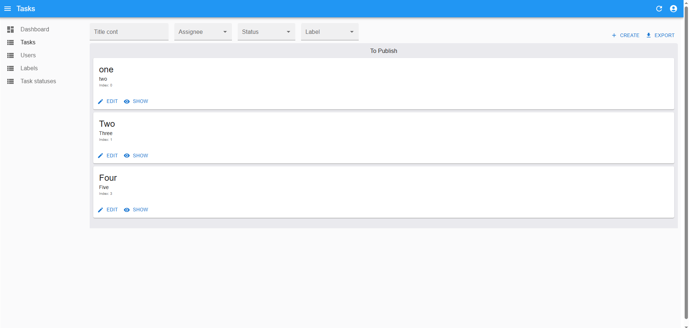
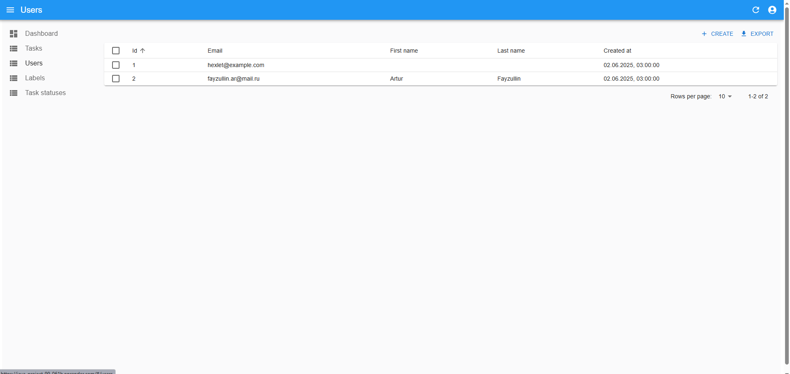
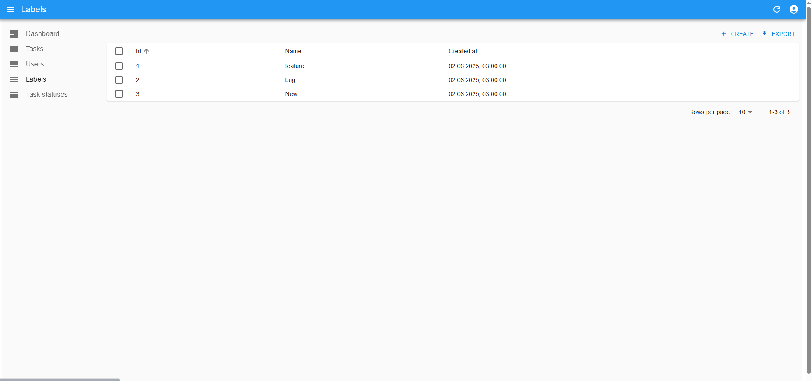
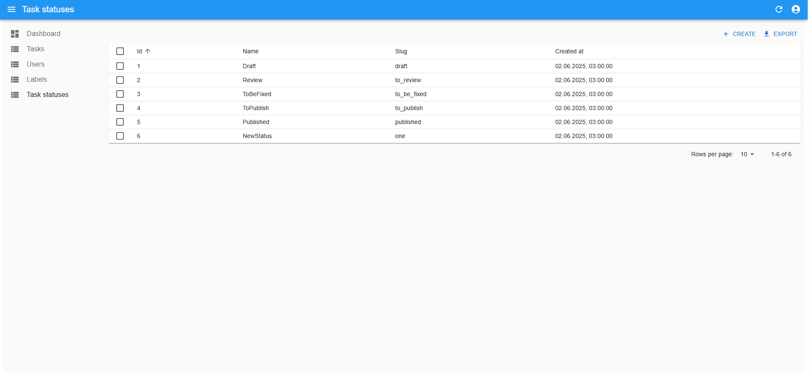

### Hexlet tests and linter status:

Ссылка:

https://java-project-99-061b.onrender.com

Task Manager – система управления задачами, подобная http://www.redmine.org/. Она позволяет ставить задачи, назначать исполнителей и менять их статусы. Для работы с системой требуется регистрация и аутентификация.

Для тестового пользования приложением можно воспользоваться временным аккаунтом:

Username: hexlet@example.com

Password: qwerty

